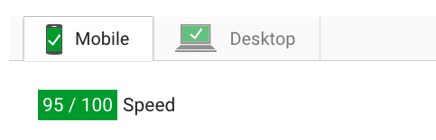
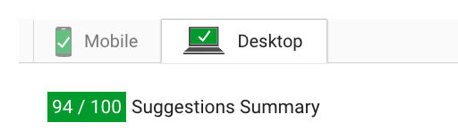

## Udacity Project 4: Website Performance Optimization

Live project is available at : **surya.github.io**

#### How to run

1. Clone this repository to run in local machine:
```html
       $ git clone surya.github.io
```
2. Launch a local server:
```html
        $ python -m SimpleHTTPServer
```
3. Open the website:
```html
        open "http://localhost:8000"
```

#### Part 1: Optimize PageSpeed Insights score for index.html
* Minify CSS and JS files : all CSS and JS files were minified to make downloading faster.They are saved with .min in their names The original-formatted files are still present in their respective directories.
* Made images repsonsive with two diferent sizes
* Added backface-visibility and transform property in .mover class (line 32) of style.min.css
```html
       backface-visibility : hidden;
       transform: translateZ(0);
```
* Reduced no. of pizzas in main.min.js from 200 to 20
* added async in JS/CSS files of index.html
* moved GoogleAnalyticsObject to footer of index.html
* Move render blocking css/js to the footer
```html
    <link href="//fonts.googleapis.com/css?family=Open+Sans:400,700" rel="stylesheet">
    <link href="css/style.min.css" rel="stylesheet">
    <link async href="css/print.min.css" rel="stylesheet">
    <script async src="js/perfmatters.js"></script>
```
* force Analytics and JS script to load asynchronously
```html
     <script async src="http://www.google-analytics.com/analytics.js"></script>
     <script async src="js/perfmatters.js"></script>

```
* removed unnecessary JS operations from main.min.js
* used document.getElementById() over document.querySelector()
```html
var pizzaSelect = document.getElementById("#pizzaSize"); at 423
and var windowwidth = document.getElementById("#randomPizzas").offsetWidth; at 444
document.getElementById("movingPizzas1").appendChild(elem); at 584
```
* document.getElementsByClassName() replaced document.querySelectorAll();
```html
var pizzaContainers = document.getElementsByClassName("randomPizzaContainer"); at 468
and
var items = document.getElementsByClassName('mover'); at 550

```
* given code brought outside loop at 494
```html
var pizzasDiv = document.getElementById("randomPizzas");
```
* items.length is replaced by len = <array>.length at 553

* no of pizza is reduced to 24 :
```html
var s = 192;
    for (var i = 0; i < 24; i++) {
```
* following code moved out of loop
```html
var movePizza = document.getElementById("#movingPizzas1"); at 577
var elem; at 576
```
* typo fixed in index.html
```html
  <link rel='preload' href='css/style.min.css' onload='requestAnimationFrame(() => this.rel="stylesheet")'>
```
# New changes

* load through Java script in index.html at line : 70
```html
<script async type="text/javascript" >
  if (!document.getElementById) document.write('<link rel="stylesheet" type="text/css" href="css/style.min.css">');
  if (!document.getElementById) document.write('<link rel="stylesheet" type="text/css" href="css/print.min.css">');
</script>
```

## Google PageSpeed Score after fixes



